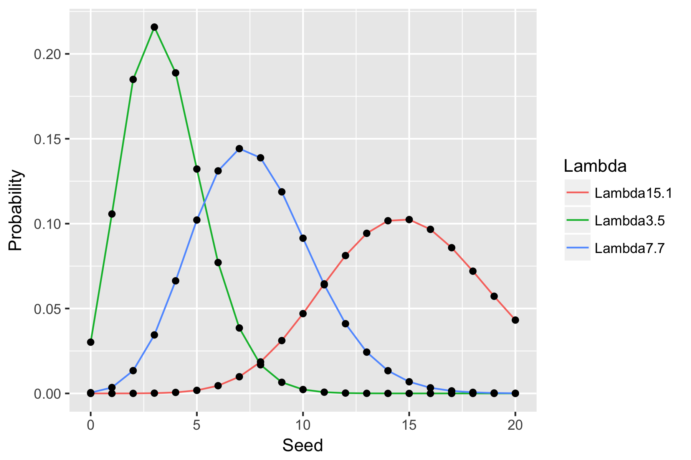

# 参考
[データ解析のための統計モデリング入門――一般化線形モデル・階層ベイズモデル・MCMC (確率と情報の科学)](https://www.amazon.co.jp/%E3%83%87%E3%83%BC%E3%82%BF%E8%A7%A3%E6%9E%90%E3%81%AE%E3%81%9F%E3%82%81%E3%81%AE%E7%B5%B1%E8%A8%88%E3%83%A2%E3%83%87%E3%83%AA%E3%83%B3%E3%82%B0%E5%85%A5%E9%96%80__%E4%B8%80%E8%88%AC%E5%8C%96%E7%B7%9A%E5%BD%A2%E3%83%A2%E3%83%87%E3%83%AB%E3%83%BB%E9%9A%8E%E5%B1%A4%E3%83%99%E3%82%A4%E3%82%BA%E3%83%A2%E3%83%87%E3%83%AB%E3%83%BBMCMC-%E7%A2%BA%E7%8E%87%E3%81%A8%E6%83%85%E5%A0%B1%E3%81%AE%E7%A7%91%E5%AD%A6-%E4%B9%85%E4%BF%9D-%E6%8B%93%E5%BC%A5/dp/400006973X/ref=sr_1_2?ie=UTF8&qid=1492985709&sr=8-2&keywords=%E4%B9%85%E4%BF%9D%E7%B5%B1%E8%A8%88)  

  

```{r}
# 描画用にデータを生成する
Data <-
  tbl_df(data) %>%
  rename(Seed=value)

Data_Ratio <-
  Data %>%
  group_by(Seed) %>%
  summarise(Ratio=n()/nrow(Data))
```

# 2.1 例題: 種子数の統計モデリング
### 個体のもつ種子数をどう表現すればよいか？
* i: 植物の第i番目の個体
* yi: その種子数
* カウントデータ
  * 非負の整数

```{r}
library(tidyverse)

load(url("http://hosho.ees.hokudai.ac.jp/~kubo/stat/iwanamibook/fig/distribution/data.RData"))
ls()

length(data)
summary(data)
table(data)
hist(data, breaks=seq(-0.5,9.5,1))
summary(data)
```

> summary(data)
   Min. 1st Qu.  Median    Mean 3rd Qu.    Max.
   0.00    2.00    3.00    3.56    4.75    7.00


# 2.2 データと確率分布の対応関係関係をながめる
## 確率変数
* 統計モデルの本質的な部品
* データにみられるさまざまなばらつきを表現できる

## 確率分布
* 確率変数の値と、出現する確率を対応させたもの
  * 例: 植物個体iの種子数yi
  * 個体数1の種子数y1=2となる確率はどのくらいか？
* 個体ごとにばらつく変数
* パラメーターの形に依存して分布の形が変化する

## ポアソン分布
* 確率分布の1つ
* パラメーターはひとつだけで分布の平均

```{r }
# 種子数がyであると觀察される確率を生成させる
Seed <- 0:9 # 種子数は0から9までと仮定する

# dataの平均3.56をとるポワソン分布において
# yが0となる確率、1となる確率...と算出する
Prob <- dpois(Seed,
              lambda=3.56)
Pois <- tbl_df(cbind.data.frame(Seed,Prob))

# Data_Ratio: 実際の観測値
# df: ポワソン分布から生成した確率分布
ggplot(Data_Ratio, aes(x=Seed,y=Ratio))+
  geom_bar(stat="identity",fill="white",colour="black")+
  geom_line(data=Pois,aes(x=Seed,y=Prob))+
  geom_point(data=Pois,aes(x=Seed,y=Prob),size=4,color="gray")+
  ylab("Ratio / Probability")
ggsave("Figure/2-1.png", plot=last_plot(), dpi=300, width=6, height=4)
```


# 2.3 ポワソン分布とは何か？
$$
p(y|\lambda)=\frac{\lambda^yexp(-\lambda)}{y!}
$$

## ポワソン分布とは？
* p(y|λ): 平均がλで有る時にポアソン分布に従う確率変数がyとなる
* 平均λのみがポワソン分布のパラメーターである
* yは0以上の整数をとる
  * つまりカウントデータとなる
* すべてのyについての確率変数の和は1
* 確率分布の平均はλ ( λ >= 0 )
* 分散と平均が等しい

## ポアソン分布に従うと考える時
* データに含まれている値が非負の整数である
  * カウントデータ
* yiに加減はあるだろうが上限がよくわからない
* 平均と分散がだいたい等しい

## λを変化させるとどう変わるか？

```{r}
df2 <- tbl_df(cbind.data.frame(Seed=y,
                 Lambda3.5=dpois(y, lambda=3.5),
                 Lambda7.7=dpois(y, lambda=7.7),
                 Lambda15.1=dpois(y, lambda=15.1))) %>%
  gather(Lambda,Probability,-Seed)
ggplot(df2, aes(x=Seed,y=Probability))+
  geom_point()+
  geom_line(aes(color=Lambda))
ggsave("Greenbook/Figure/2-2.png",plot=last_plot())
```



* 平均値が右にずれ、裾野が広くなっていく

# ポアソンぶんぷ分布のパラメーターの最尤推定
## 尤度
* 尤度: あてはまりの良さを表す統計量
* すべての個体iに対するp(yi|λ)の積
* y1が2、y2が3...y5が2という事象が、同時に真である確率を求めたいため

## 最尤推定
* Maximam liklihood estimation
* どんな確率分布を使った統計モデルにも適応できる
* 尤度を最大にするようなパラメーターを探索するための手法の1つ
  * ポワソン分布の場合はλ
* この尤度の積は尤度関数と呼ばれ、変数はλである
* 対数尤度関数
  * 1以下のものを積にするので対数変換して表すと扱いやすい
* 対数尤度が大きい ( ゼロに近い ) ほど観測データとポアソン分布が似ていると判断する

$$
\log L (\lambda) = \sum_{i}(y_i\log\lambda=\lambda=\sum_{k}^{y_i}\log K
$$

```{r}
# 平均をmとおく
# dataに関して、平均mのポワソン分布に従う確率変数を求める
# 対数をとってから総和とし、これが最大となるつまりゼロに近づくポイントを探す
logL <- function(m)sum(dpois(data, m, log=TRUE))
lambda <- seq(2,5,0.1) # 0.1刻みで2から5まで


plot(lambda, sapply(lambda, logL), type="l")
```

* 3.5から3.6のあたりで対数尤度が最大になるλ
* 対数尤度 logLは尤度Lの単調増加関数
  * 対数尤度が最大になるλにおいて尤度が最大になる
* 対数尤度の最大値を求めるには、関数の傾きが0になるポイントを見つける
  * 偏微分する
* 最尤推定量: 尤度が最大になるλを指す

対数尤度関数logL(λ)をパラメーターλで偏微分すると

$$
\frac{\partial \log L(\lambda)}{\partial\lambda}= \sum_{i} ( \frac{y_i}{\lambda}-1)=\frac{1}{\lambda}\sum_{i}y_i-50
$$

これがゼロなので

$$
\lambda=\frac{1}{50}\sum_{i}y_i=\frac{全部のy_iの和}{データ数}=データの標本平均=3.56
$$


# 2.4.1 擬似乱数お最尤推定値のばらつき

```{r}
# 50の平均値3.5のポワソン乱数
rpois(50,3.5)
```
* いつか自分でプロットできるようにスクリプトを書く
* [参考](http://norimune.net/2510)


# 2.5 統計モデルの要点: 乱数発生・推定・予測
* ばらつきのあるデータはなにか何かかくりつぶんぷ何か確率分布から発生したと考えると扱いやすそうだと考えることが統計モデリングの1歩
* 推定 ( estimate ) = あてはめ ( fitting )
  * パラメーターλはどんな値なのか？という問いにに答えるもの
* 予測
  * 推定で得られた統計モデルを使用して同じ調査方法でエアれる次のデータの分布をみつもる
  * 時系列データの予測 -> 将来予測
  * データの欠測データを埋める
* 予測の良さ ( goodness of prediction )
  * 推定されたモデルが新しく得られたデータにどれくらいよく当てはまるか？

# 2.5.1 データ解析における推定・予測の役割
* 推定しただけでは不十分
  * 必ず予測を試みる
  * 自分が使っている近似的・現象論的な統計モデルの理解が深まる

# 2.6  確率分布の選び方
* この減少減少がどのような確率分布で説明されそうか？
* 離散変数 vs 連続変数
* 範囲
* 標本分散と標本平均の関係は？

## まとめ
確率分布|性質|範囲|平均と分散
:-:|:-:|:-:|:-:
ポアソン分布|離散値|ゼロ以上、特になし|平均と分散が近い
二項分布|離散値|ゼロ以上で有限の範囲|分散は平均の関数
正規分布|連続値|[-∞,+∞]|分散は平均と無関係
ガンマ分布|連続値|[0,+∞]|分散は平均の関数

# 2.6.1 もっと複雑な確率分布が必要か？
* カウントデータなのにヒストグラムはポアソン分布に見えない時
  * 実験処理や植物の個体サイズなど
  * 説明変数によって個体ごとの種子数の平均の平均が変化するモデルを使用して解析する
    * それでもだめならデータ化されていない個体差・みなかった個体差を組み込んだｓ統計モデリングが必要
