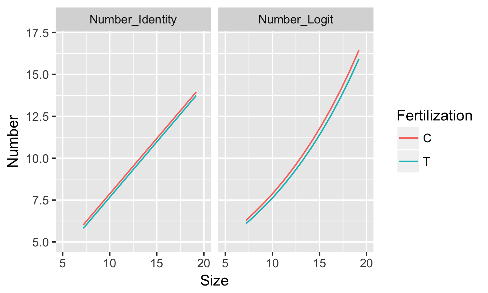

* 説明変数を組み込んだ統計モデリング
* すべての種子数が同じ平均のポアソン分布に従うという仮定
   * 個体ごとに平均種子数が異なると考える
   * このような統計モデルを観測データにあてはめることをポアソン回帰という
   * 総称して一般化線形モデル
    * Generalized linear model ( GLM )
  

# 参考
[データ解析のための統計モデリング入門――一般化線形モデル・階層ベイズモデル・MCMC (確率と情報の科学)](https://www.amazon.co.jp/%E3%83%87%E3%83%BC%E3%82%BF%E8%A7%A3%E6%9E%90%E3%81%AE%E3%81%9F%E3%82%81%E3%81%AE%E7%B5%B1%E8%A8%88%E3%83%A2%E3%83%87%E3%83%AA%E3%83%B3%E3%82%B0%E5%85%A5%E9%96%80__%E4%B8%80%E8%88%AC%E5%8C%96%E7%B7%9A%E5%BD%A2%E3%83%A2%E3%83%87%E3%83%AB%E3%83%BB%E9%9A%8E%E5%B1%A4%E3%83%99%E3%82%A4%E3%82%BA%E3%83%A2%E3%83%87%E3%83%AB%E3%83%BBMCMC-%E7%A2%BA%E7%8E%87%E3%81%A8%E6%83%85%E5%A0%B1%E3%81%AE%E7%A7%91%E5%AD%A6-%E4%B9%85%E4%BF%9D-%E6%8B%93%E5%BC%A5/dp/400006973X/ref=sr_1_2?ie=UTF8&qid=1492985709&sr=8-2&keywords=%E4%B9%85%E4%BF%9D%E7%B5%B1%E8%A8%88)  
  

```{r}
library(tidyverse)
```

# 3.1. 例題: 個体ごとに平均種子数が異なる場合
* 架空の植物の第i番目の個体が
  * 植物の体サイズxiと施肥処理fiが種子数yiとどう影響するのかを明らかにする
<br>
<br>
  
# 3.2. 観測されたデータの概要を調べる
# 3.3. 統計モデリングの前にデータを図示する

```{r} 
# y: 種子数
# x: 身体サイズ
# f: C 肥料なし / T 施肥処理
d3 <-
  read.csv("http://hosho.ees.hokudai.ac.jp/~kubo/stat/iwanamibook/fig/poisson/data3a.csv")
summary(d3)

# Scatter plot
ggplot(d3, aes(x=x, y=y, color=f))+
  geom_point(size=2)
ggsave("Greenbook/Figure/3-2.png",plot=last_plot(), width=3.5, height=3)

# Boxplot
ggplot(d3, aes(x=f, y=y, fill=f))+
  geom_boxplot()
ggsave("Greenbook/Figure/3-3.png",plot=last_plot(), width=3.5, height=3)
```

> summary(d3)
       y               x          f     
 Min.   : 2.00   Min.   : 7.190   C:50  
 1st Qu.: 6.00   1st Qu.: 9.428   T:50  
 Median : 8.00   Median :10.155         
 Mean   : 7.83   Mean   :10.089         
 3rd Qu.:10.00   3rd Qu.:10.685         
 Max.   :15.00   Max.   :12.400  
 
  
* サイズが大きくなると種子数は増えていく

* 肥料の効果はあまりなさそう
<br>
<br>
    
# 3.4. ポアソン回帰の統計モデル
* 個体ごとの平均種数λiが身体サイズxiや施肥効果fに影響されるモデルを考える
* まずは効果のなさそうなfを無視してxだけに着目する
  
$$
p(y_i|\lambda_i) = \frac{ \lambda_u^{y_i} exp(- \lambda_i)}{y_i!}
$$
<br>
<br>

# 3.4.1 線形予測子と対数リンク関数
* 平均λを説明変数xiの関数として定義する
* $$\beta_1$$ : 切片
* $$\beta_2$$ : 傾き

$$
\lambda_i = exp( \beta_1 +  \beta_2 x_i )
\log\lambda_i = \beta_1 + \beta_2 x_i
$$

* 右辺が線形予測子と呼ばれる
* 回帰式の左辺をリンク関数と呼ぶ 
  * 対数を取られていたら対数リンク関数となる
  * 特にリンク関数が何もない場合は恒等リンク関数と呼ぶ
    * 平均が線形予測子 ( 右辺 ) にそのまま等しくなっている状態
    * 線形予測子に変数が組み込まれていない状態
    
    
## 正準リンク関数
* それぞれの確率分布に適したリンク関数のこと
  * 推定計算に都合が良く、かつわかりやすいため
* ポアソン回帰 ( ポアソン分布 ) のGLMには対数リンク関数を使用することが多い
  * 対数リンク関数だとλ>=0となることが都合良い
  * 正準リンク関数を用いることでパラメーターがどのような値になっても条件が守られるため便利
  * また要因の効果が積で表されることもメリット
* ロジスティック回帰 ( 二項分布 ) のGLMにはロジットリンク関数を使用することが多い
* Rのglm()では
  * 特に指定しなければ各family ( ばらつきの確率分布 ) ごとに異なる正準リンク関数を使用する
<br>
<br>

# 3.4.2 あてはめとあてはまりの良さ
* このモデルの対数尤度

$$
logL(\beta_1,\beta_2) = \sum_i log \frac{{\lambda_i}^{y_i}exp{-\lambda_i}} {y_i!}
$$

* 線形予測子は下記であり、λはβ1とβ2の関数になっている
  * 2つのパラメーターなので少し大変にはなるが、Rでは簡単

$$
log \lambda_i = \beta_1 + \beta_2 x_i
$$

```{r }
# 傾きβ1と傾きβ2の最尤推定値が得られる
fit <- glm(y~x,
           data=d3,
           family=poisson)
summary(fit)
```


> summary(fit)
Coefficients:
            Estimate Std. Error z value Pr(>|z|)    
(Intercept)  1.29172    0.36369   3.552 0.000383 ***
x            0.07566    0.03560   2.125 0.033580 *  


### 1. Estimate
* 最尤推定値
* β1 ( Intercept ) = 1.29
* β2 ( x ) = 0.0757
  
#### 2. Std.Error
* Estimateの値の標準誤差の推定値
  * β1とβ2のばらつきを表す
* 対数尤度は上記の通り、最尤推定値で最大値となる凸関数
  * 推定のばらつきが正規分布であると仮定
  * さらに対数尤度関数が最大値付近での形が正規分布に近いと仮定
  * この特性を利用して推定値を得ている

### 3. Z
* Estimate / SEで算出
* Ward統計量とも呼ばれる
* Wald信頼区間を構成
* 推定値がゼロから十分にはなれているかの指標

### 4. Pr(>|z|)
* glm()の場合
* 平均がz値の絶対値であり、標準偏差が1の正規分布における、マイナス無限大からゼロまでの値をとる確率の二倍
  * 信頼区間の算出方法と似ている
* 確率が大きいほどz値がゼロに近くなる
  * 推定値β1やβ2がゼロに近いことを表現する
* P値にみたてて、統計検定ができるとかんがえる人も
  * むしろ推定値の信頼区間が近似的に算出されたと考えるべき
  
## 最大対数尤度
* あてはまりの良さを表す
* あてはまりが最もよくなるのは、対数尤度$logL(\beta_1,\beta_2)$が最大になっているところ
* つまりパラメーターの値が最尤推定血$\beta_1,\beta_2$となっているとき

```{r }
# Rを使ってこのモデルの最大対数尤度を評価する
logLik(fit)
```

* このことから最大対数尤度は-235.4とわかる
* df: degrees of freedom
  * 自由度
  * 最尤推定下パラメーター数が2個であるということ ( β1とβ2 )
<br>
<br>

# 3.4.3 ポアソン回帰モデルによる予測
* ポアソン回帰の推定結果を使って、体サイズxにおける平均種子数λの予測を行う
* 推定値｛β1,β2}を代入した関数

$$
\lambda = exp(1.29 + 0.0757x)
$$

```{r }
# 架空の植物のサイズを生成
Size <- seq(min(d3$x), length=100)

Number_Pred <- predict(fit, # GLMによるモデル
                   newdata= data.frame(x=Size), # 予測したいデータ
                   type="response")

df_Pred <- cbind.data.frame(Size,Number_Pred)

ggplot(d3, aes(x=x, y=y))+
  geom_point(size=2, aes(color=f))+
  geom_line(data=df_Pred, aes(x=Size, y=Number_Pred))+
  xlim(6.8,12.2)+ylim(2,15)
ggsave("Greenbook/Figure/3-7.png",plot=last_plot(), width=3.5, height=3)
```

  
<br>
<br>


# 3.5 設営変数が因子型の統計モデル
* 施肥効果fiを説明変数として組み込んだモデルを検討してみる
* 因子型変数はRの中でダミー変数に置き換えられている
* Rで操作する場合は説明変数に施肥効果fiをｄ指定する指定するだけ
<br>

* 植物のサイズxiの効果を無視して施肥効果fiだけが影響するモデル
  * β1は切片
  * β3は施肥の効果を表す
  
$$
\lambda_i = exp ( \beta_1 + Beta_3 d_i)
$$

* 説明変数diは下記の様に置き換えられる
  * fi = C -> di = 0
  * fi = T -> di = 1
* 肥料なし ( di = 0 ) の場合は $ \lambda_i = exp ( \beta_1 ) $
* 肥料あり ( di = 1 ) の場合は $ \lambda_i = exp ( \beta_1 + \beta3 ) $


```{r}
fit.f  <-  glm(y~f, # 施肥効果のみをモデルに組み込む
               data=d3, 
               family=poisson)

summary(fit.f)
```

> Call:  glm(formula = y ~ f, family = poisson, data = d)

> Coefficients:
(Intercept)           fT  
    2.05156      0.01277  

> Degrees of Freedom: 99 Total (i.e. Null);  98 Residual  
Null Deviance:	    89.51   
Residual Deviance: 89.48 	AIC: 479.3  

これはfがTを取る時に  

$$
\lambda_i = exp(2.05+0.0128) = exp(2.0628) = 7.87
$$

となり、fがdammy変数0 ( C ) を取る時は  

$$
\lambda_i = exp(2.05) = 7.77
$$

とやや値が小さくなることを示す。つまり、肥料をやると平均種子数がほんのすこしだけ増える  


```{r }
# 最大対数尤度を求める
logLik(fit.f)
```

> logLik(fit.f)  
'log Lik.' -237.6273 (df=2)  
  
となっており、xiだけのモデルより小さく当てはまりが悪くなっている
<br>
<br>


# 3.6. 説明変数が数量型+因子型の統計モデル

$$
log \lambda_i = \beta_1 + \beta_2 x_i + \beta_3 d_i
$$

```{r }
fit.all <- glm(y~x+f,
               data=d3,
               family=poisson)
fit.all
logLik(fit.all)
```

> fit.all

Call:  glm(formula = y ~ x + f, family = poisson, data = d3)

Coefficients:
(Intercept)            x           fT  
    1.26311      0.08007     -0.03200  

Degrees of Freedom: 99 Total (i.e. Null);  97 Residual
Null Deviance:	    89.51 
Residual Deviance: 84.81 	AIC: 476.6  
<br>
> logLik(fit.all)
'log Lik.' -235.2937 (df=3)

* 少しだけあてはまりがよくなっている
<br>
<br>

# 3.6.1 対数リンク関数のわかりやすさ: 掛け算される効果
* 対数リンク関数では要因の効果が積で表される

```{r }
Fit_Logit <- glm(y~x+f, 
               data=d3,
               family=poisson) # ポワソン分布の正準リンク関数である対数リンク関数
Fit_Identity <- glm(y~x+f,
               data=d3,
               family=poisson(link = "identity")) # 恒等リンク関数となる

Size <- rep(seq(min(d3$x), length=100),2) # 2set
Fertilization <- c(rep("C",100),rep("T",100))

Number_Logit <- predict(Fit_Logit, # GLMによるモデル
                   newdata= data.frame(x=Size,f=Fertilization), # 予測したいデータ
                   type="response")

Number_Identity <- predict(Fit_Identity, # GLMによるモデル
                   newdata= data.frame(x=Size,f=Fertilization), # 予測したいデータ
                   type="response")

df_Pred <-
  cbind.data.frame(Size,Fertilization,Number_Logit,Number_Identity) %>%
  gather(Link,Number,-1:-2) 

ggplot(df_Pred, aes(x=Size, y=Number))+
  geom_line(aes(color=Fertilization))+
  facet_wrap(~Link)+
  xlim(5,20)+ylim(5,17)
ggsave("Greenbook/Figure/3-8.png",plot=last_plot(), width=5, height=3)
```

  

### 恒等リンク関数の解釈
* 無処理における平均種子数が0.1個だろうが1000個だろうが施肥処理をしたら同じだけ減るということ
<br>
<br>

# 3.7. 何でも正規分布・何でも直線には無理がある
## 線形モデル: Linear Model
* 確率分布は等分散の正規分布でリンク関数を恒等リンク関数を指定した場合
  * つまり一般線形モデルとなる
    * または直線回帰
  * 一般線形モデル: " General " Linear Model
  * Generalized ではないことに注意 
  
* 観測値{x1,x2,...,xn}と{y1,y2,...,yn}のペアが存在
* xiを説明変数、yiを応答変数と呼ぶ
* Yは平均μiで標準偏差δの正規分布に従うとする
* あるデータ点iにおいて平均値がμi=β1＋β2xiとなる
↓  
* 正規分布は連続的な値を扱う確率分布
* カウントデータなのに平均値の予測がマイナスになる
* 図で見るとばらつき一定でなさそうなのに、分散一定を仮定している

## その他の線形モデル
### 重回帰
  * 複数の数量があの説明変数がある場合

### ANOVA
  * 説明変数xiが因子型であるモデルのあてはめ

### ANCOVA
  * 説明変数が2つ以上る
  * かつ、数量型・因子型の説明変数が混在しているモデル
  
* 応答変数yをlogyのように変数変換して直線回帰することと、ポアソン回帰はまったく別のものである
  * yがゼロ日t回値での対数変換はデータのばらつきの見た目を少し変える程度
  * 無理矢理正規分布を当てはめる利点がない
  
## GLM ( 一般化の方 ) とは
* ポアソン回帰やロジスティック回帰など、幾つかの制約を満たしている統計モデルの総称
* 確率分布とリンク関数、線形予測子を指定する統計モデル
* Rのglm()関数でパラメーターを推定する
* 数量型と因子型の両方の説明変数を同時に組み込んで良い
* 対数リンク関数を用いると説明変数の効果が積として表現できるので理解しやすい
* データをうまく表現できる確率分布を選ぶという発送
* なんでも正規分布ちう考え方から脱却できる