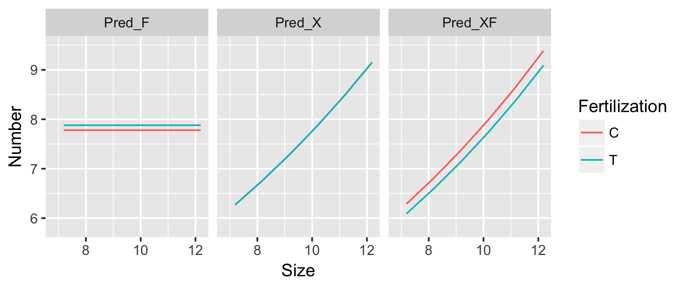

# 参考
[データ解析のための統計モデリング入門――一般化線形モデル・階層ベイズモデル・MCMC (確率と情報の科学)](https://www.amazon.co.jp/%E3%83%87%E3%83%BC%E3%82%BF%E8%A7%A3%E6%9E%90%E3%81%AE%E3%81%9F%E3%82%81%E3%81%AE%E7%B5%B1%E8%A8%88%E3%83%A2%E3%83%87%E3%83%AA%E3%83%B3%E3%82%B0%E5%85%A5%E9%96%80__%E4%B8%80%E8%88%AC%E5%8C%96%E7%B7%9A%E5%BD%A2%E3%83%A2%E3%83%87%E3%83%AB%E3%83%BB%E9%9A%8E%E5%B1%A4%E3%83%99%E3%82%A4%E3%82%BA%E3%83%A2%E3%83%87%E3%83%AB%E3%83%BBMCMC-%E7%A2%BA%E7%8E%87%E3%81%A8%E6%83%85%E5%A0%B1%E3%81%AE%E7%A7%91%E5%AD%A6-%E4%B9%85%E4%BF%9D-%E6%8B%93%E5%BC%A5/dp/400006973X/ref=sr_1_2?ie=UTF8&qid=1492985709&sr=8-2&keywords=%E4%B9%85%E4%BF%9D%E7%B5%B1%E8%A8%88)  
  

```{r}
library(tidyverse)
```

# 4.0
## モデル選択
* 複数の統計モデルの中から良いモデルを選ぶこと
* たくさんの観測データに当てはまるものが良い統計モデルではない
  * モデルを複雑にすれば観測データへのあてはまりはよくなる

## AIC
* モデル選択の一手法
* 良い予測をするモデルが良いモデルであるという考えにもとづいて設計された
<br>
<br>

# 4.1. データはひとつ、モデルはたくさん
```{r} 
# y: 種子数
# x: 身体サイズ
# f: C 肥料なし / T 施肥処理
d3 <-
  read.csv("http://hosho.ees.hokudai.ac.jp/~kubo/stat/iwanamibook/fig/poisson/data3a.csv")

Size <- rep(seq(min(d3$x), length=100),2) # 2set
Fertilization <- c(rep("C",100),rep("T",100))

Pred_X <- predict(glm(y~x,data=d3,family=poisson), # GLMによるモデル
                   newdata= data.frame(x=Size,f=Fertilization), # 予測したいデータ
                   type="response")
Pred_F <- predict(glm(y~f,data=d3,family=poisson), # GLMによるモデル
                   newdata= data.frame(x=Size,f=Fertilization), # 予測したいデータ
                   type="response")
Pred_XF <- predict(glm(y~x+f,data=d3,family=poisson), # GLMによるモデル
                   newdata= data.frame(x=Size,f=Fertilization), # 予測したいデータ
                   type="response")

Pred_d3 <-
  cbind.data.frame(Size,Fertilization,Pred_X,Pred_F,Pred_XF) %>%
  gather(Model,Number,-1:-2) 

ggplot(Pred_d3, aes(x=Size, y=Number))+
  geom_line(aes(color=Fertilization))+
  facet_wrap(~Model)+
  xlim(6.8,12.2)+ylim(5.8,9.5)
ggsave("Greenbook/Figure/4-2.png",plot=last_plot(), width=6, height=2.5)
```
  

* 今、手元にある観測データへの当てはまりの良さを考える
  * 対数尤度
  * 最も当てはまりの良いモデルを考えるためのパラメーターが最大対数尤度
* ただし、最大対数尤度は良いモデルの指標にはならないことに注意！


# 4.2. 統計モデルのあてはまりの悪さ
## 逸脱度 ( deviance )
* あてはまりの悪さ
* glm()でも出力される
* 対数尤度$Log L({\beta_j})$を$log L$と表現する

$$
D=-2logL
$$

* 逸脱度Dは最大対数尤度に-2をかけているだけ
  * -2をかけるとカイ二乗分布への対応関係がよくなるため
  
名前|定義
:-:|:-:
逸脱度|-2logL
最小の逸脱後|フルモデルをあてはめたときのD
残渣逸脱度|D-最小のD
最大の逸脱度|Nullモデルを当てはめたときのD
Null逸脱度|最大のD-最小のD

```{r }
# y: 種子数
# x: 身体サイズ
# f: C 肥料なし / T 施肥処理
d3 <- read.csv("http://hosho.ees.hokudai.ac.jp/~kubo/stat/iwanamibook/fig/poisson/data3a.csv")
summary(d3)

# 傾きβ1と傾きβ2の最尤推定値が得られる
# 平均種子数λiが植物の体サイズxiにだけに依存するモデル
Fit_X <- glm(y~x,
           data=d3,
           family=poisson)
Fit_X

# 最大対数尤度
logLik(Fit_X)

# 逸脱度を最大対数尤度×2で計算
-2*logLik(Fit_X)
# glmの結果から表示
Fit_X$aic
```

> Fit_X

Call:  glm(formula = y ~ x, family = poisson, data = d3)

Coefficients:
(Intercept)            x  
    1.29172      0.07566  

Degrees of Freedom: 99 Total (i.e. Null);  98 Residual
Null Deviance:	    89.51 
Residual Deviance: 84.99 	AIC: 474.8

> 逸脱度を最大対数尤度×2で計算
> -2*logLik(Fit_X)

'log Lik.' 470.7725 (df=2)

> glmの結果から表示
> Fit_X$aic

[1] 474.7725  


  
## フルモデル
* データ数n個に対して、n個のパラメーターすべてを使用してあてはめたモデル
* 当然、最大対数尤度が他のモデルと比べて最大になり逸脱度も最小になる
* 全データを読み上げていることと同じで統計モデルとして価値はない

## 残差逸脱度
* Residual Deviance
* 残差逸脱度 = 逸脱度 - ポアソン分布モデルで可能な最小逸脱度
* ポアソン分布モデルで可能な最小逸脱後 = フルモデルでの逸脱度
* 最小逸脱度から見た、逸脱度の相対値を表す

```{r}
# xモデル ( サイズをあてはめたモデル ) の残差逸脱度を直接計算する
# 種子数のデータ
d3$y

# 100個のyiに対して平均をyiとした時の尤度関数
dpois(d3$y, lambda=d3$y)

# 100個のyiに対して平均をyiとした時の対数尤度関数
log(dpois(d3$y, lambda=d3$y))

# 100個のyiに対して平均をyiとした時の対数尤度の和 ( フルモデルの最大対数尤度 )
sum(log(dpois(d3$y, lambda=d3$y)))

# フルモデルの最大対数尤度の2倍 = 最小逸脱度
-2*sum(log(dpois(d3$y, lambda=d3$y)))

# x ( サイズ ) のみをモデルに組み込んだ時の逸脱度
-2*logLik(Fit_X)

# 残差逸脱度 = そのモデルの逸脱度 - フルモデルの逸脱度
-2*logLik(Fit_X) - -2*sum(log(dpois(d3$y, lambda=d3$y)))

# Fit_Xの結果における残差逸脱度
Fit_X
```

## ヌルモデル
* 最もパラメーター数の少ないモデル
* 切片 $\beta_1$ だけのモデル
  * パラメーター数 k=1
* 当然、最大対数尤度が他のモデルと比べて最小になり、最も逸脱度は最大になる

```{r}
fit.null <- glm(y~1,
                family=poisson,
                data=d3)
fit.null
logLik(fit.null)
```

> fit.null

Call:  glm(formula = y ~ 1, family = poisson, data = d3)
Coefficients:
(Intercept)  
      2.058  

Degrees of Freedom: 99 Total (i.e. Null);  99 Residual
Null Deviance:	    89.51 
Residual Deviance: 89.51 	AIC: 477.3

> logLik(fit.null)

'log Lik.' -237.6432 (df=1)
<br>
<br>

# 4.3 モデル選択基準AIC
* パラメーターの数の多い統計モデルほどデータのあてはまりが良くなる
  * たまたま得られたデータへのあてはめ向上を目的とする特殊化にすぎない
  * 統計モデルの予測の良さを損なっている可能性
  
## モデル選択 
* 複数の統計統計モデルから何らかの基準で良いモデルを選択すること
* AIC: Akaike's information criterion
  * あてはまりの良さだけでなく、予測の良さを重視するモデル
* AICが最小のモデルｇが良いモデルとなる

$$
AIC = -2 { ( \mbox{最大対数尤度} )} - \mbox{最尤推定したパラメーター数} ) }
= -2 ( log L - k )
= D+2k
$$

