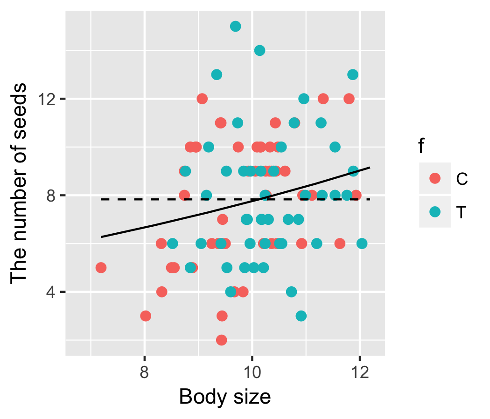
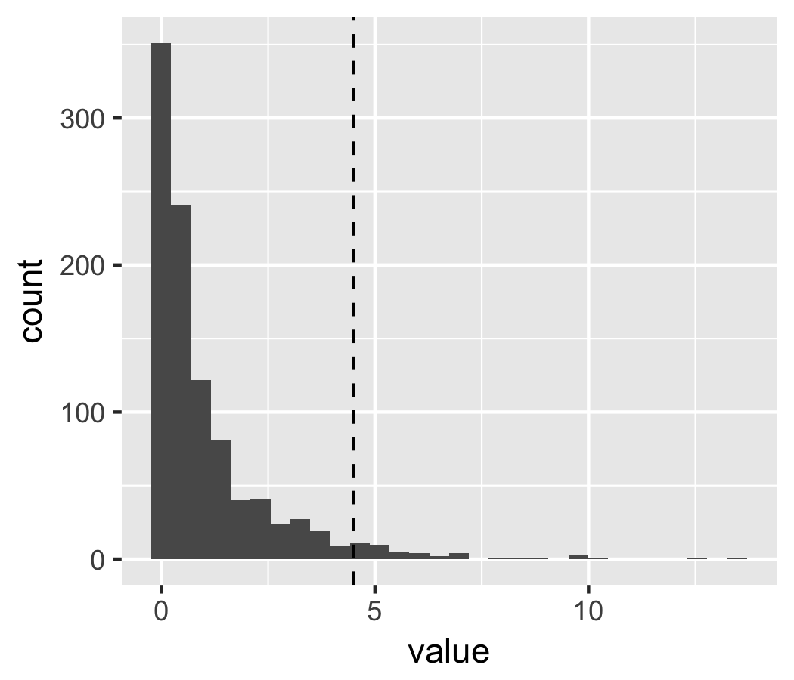

# 参考
[データ解析のための統計モデリング入門――一般化線形モデル・階層ベイズモデル・MCMC (確率と情報の科学)](https://www.amazon.co.jp/%E3%83%87%E3%83%BC%E3%82%BF%E8%A7%A3%E6%9E%90%E3%81%AE%E3%81%9F%E3%82%81%E3%81%AE%E7%B5%B1%E8%A8%88%E3%83%A2%E3%83%87%E3%83%AA%E3%83%B3%E3%82%B0%E5%85%A5%E9%96%80__%E4%B8%80%E8%88%AC%E5%8C%96%E7%B7%9A%E5%BD%A2%E3%83%A2%E3%83%87%E3%83%AB%E3%83%BB%E9%9A%8E%E5%B1%A4%E3%83%99%E3%82%A4%E3%82%BA%E3%83%A2%E3%83%87%E3%83%AB%E3%83%BBMCMC-%E7%A2%BA%E7%8E%87%E3%81%A8%E6%83%85%E5%A0%B1%E3%81%AE%E7%A7%91%E5%AD%A6-%E4%B9%85%E4%BF%9D-%E6%8B%93%E5%BC%A5/dp/400006973X/ref=sr_1_2?ie=UTF8&qid=1492985709&sr=8-2&keywords=%E4%B9%85%E4%BF%9D%E7%B5%B1%E8%A8%88)  
  

```{r}
library(tidyverse)
```
<br>
<br>

# Introduction
## 尤度比検定
* Likelihood ratio test
* 逸脱度の差に注目する
* 尤度比検定はどのような統計モデルでも、ネストされているモデルならば比較できる

## パラメトリック
* 正規分布を使ったという意味ではなく、多く誤用されている??
  * 正規分布に限らず厳密な分布の形の仮定を必要とする ( 参考: [六本木で働くデータサイエンティストのブログ](http://tjo.hatenablog.com/entry/2013/11/19/093218) )
* 比較的少数のパラメーターを持つ、という意味??

## ノンパラメトリック
* 順序統計量を使った検定
* 多数のパラメターを使って自由自在な構造を持つという意味でも使われる
* 正規分布じゃない、何も仮定しなくていいという理由で使用するのは危険

###  [参考: 粕谷さんセミナー二本立て!](http://hosho.ees.hokudai.ac.jp/trendy/2007/abstract/trendy152.html)
* 実際の長所と弱点は意外に知られていない

#### 長所
* 正規線形モデルの方法 ( t検定や分散分析など ) との比較して
  * 母集団の分布が何であってもt検定以上の検出力を持つノンパラメトリックな検定が必ずある
  * 母集団が正規分布から外れれば、t検定を超える検出力を持つノンパラメトリックな検定がある
* 順位をとることでの情報のロスは多くの場合にはわずかである

#### 短所
* 等分散を前提にしており不等分散の状況には不向き
* データが顕著な不等分散を示すときに好んでノンパラメトリックな検定を使用する、”自殺的”解析はしばしば見られる
* 生態学でのデータ解析における最大の弱点は説明変数が複数のときにある
  * とくに交互作用の扱いに顕著に表れる
<br>
<br>

# 5.1 統計学的な検定の枠組み
## 検定とモデル選択の共通点
* 使用するデータを確定する
* 一度データが確定したら、最後までそのデータのすべてを常に使用する
  * 検定でもモデル選択でも、モデルごとに異なるデータを使用してはいけない
* 目的とデータの構造に対応した ( データを説明できるような ）適切な統計モデルを設計する
* これを使ってパラメーターを最尤推定する

## 検定とモデル選択の相違点 ( 検定の特徴 )
* 単純モデル -> 帰無仮説 ( null hypothesis )
  * 棄却されるための仮説
  * 無に帰される時にのみ、その役割を果たす
* 複雑モデル -> 対立仮説 ( alternative hypothesis )
  * 対立仮説ではなく代替仮説とした方が正しい可能性
  * 帰無仮説が棄却された後に、現象の説明を代替するために残されたモデルであるため
* 統計モデルの検定では、帰無仮説が正しいという命題が否定できるかどうかだけを調べる

### 統計モデルの検定の実際
#### Neyman-Pearsonの検定の枠組み
* モデルのあてはまりの良さなどを統計検定量に指定する
* **帰無仮説が真のモデルであると仮定する**
  * たまたま得られた有限の観測データかｒから推定されたモデルが真のモデルになるかどうかは怪しいと考えるのが妥当
* 統計検定量の理論的なばらつき ( 確率分布 ) を求める
* 統計検定量の値がとりうるありがちな範囲を決める
  * ありがちな範囲の大きさが95%以上
  * つまり有意水準が5%になるように設定したということ
* 対立仮説対立仮説のモデルで統計検定量を計算する
  * ありがちな範囲からはみ出ているか確認する
  * はみ出ていれば、帰無仮説は棄却される
  * 対立仮説ｇがしじされたが支持されたと結論でづける
<br>
<br>

# 5.2 尤度比検定の例題: 逸脱度の差を調べる

## Figure 5-2.
```{r} 
# y: 種子数
# x: 身体サイズ
# f: C 肥料なし / T 施肥処理
d3 <-
  read.csv("http://hosho.ees.hokudai.ac.jp/~kubo/stat/iwanamibook/fig/poisson/data3a.csv")
summary(d3)

Size <- rep(seq(min(d3$x), length=100))

Pred_X <- predict(glm(y~x,data=d3,family=poisson), # GLMによるモデル
                   newdata= data.frame(x=Size,f=Fertilization), # 予測したいデータ
                   type="response")

Pred_1 <- predict(glm(y~1,data=d3,family=poisson), # 1にすると一定モデル ( 平均となる )
                   newdata= data.frame(x=Size,f=Fertilization), # 予測したいデータ
                   type="response")

Pred_d3 <-
  cbind.data.frame(Size,Pred_X,Pred_1)

# Scatter plot
ggplot(d3, aes(x=x, y=y))+
  geom_point(size=2, aes(color=f))+
  geom_line(data=Pred_d3, aes(x=Size, y=Pred_X))+
  geom_line(data=Pred_d3, linetype="dashed", aes(x=Size, y=Pred_1))+
  xlim(6.8,12.2)+ylim(2,15)+
  xlab("Body size") + ylab("The number of seeds")
ggsave("Greenbook/Figure/5-2.png",plot=last_plot(), width=3.5, height=3)
```



<br>
<br>

## Table 5-1
```{r} 
# 逸脱度を計算する
# 1. 計算式より
Fit_1 <- glm(y~1,
           data=d3,
           family=poisson)

Fit_X <- glm(y~x,
           data=d3,
           family=poisson)

Model_1 <- c("Model_1",1,logLik(Fit_1), -2*logLik(Fit_1), Fit_1$deviance, Fit_1$aic)
Model_X <- c("Model_X",2,logLik(Fit_X), -2*logLik(Fit_X), Fit_X$deviance, Fit_X$aic)

Model <- rbind.data.frame(Model_1,Model_X)
colnames(Model) <- c("Model","k","logL","Deviance","Residual Deviance","AIC")

library(knitr)
kable(Model,align="c")
```

|  Model  | k |       logL        |     Deviance     | Residual Deviance |       AIC        |
|:-------:|:-:|:-----------------:|:----------------:|:-----------------:|:----------------:|
| Model_1 | 1 | -237.643221309287 | 475.286442618573 | 89.5069375695814  | 477.286442618573 |
| Model_X | 2 | -235.386250769861 | 470.772501539722 | 84.9929964907296  | 474.772501539722 |
<br>
<br>

## 尤度比検定
$$
\frac(L_1)(L_2) = \frac( \mbox{一定モデルの最大尤度} ) ( \mbox { xモデルの最大尤度 })
$$

これを実際には対数を取って-2をかけて**統計検定量として**使用する

$$
\begin{eqnarray}
\Delta_{1,2} &=& -2 * ( log L_1 - log L_2) \\
&=& D_1 - D_2 \\
&=& \mbox{一定モデルの逸脱度} - \mbox{xモデルの逸脱度}
\end{eqnarray}
$$

```{r}
# 逸脱度の差を求める
Fit_1$deviance - Fit_X$deviance
```

```
> Fit_1$deviance - Fit_X$deviance
  
[1] 4.513941
```

* つまり変数xを加えることで、逸脱度が4.5改善するということ
* 4.5上昇することが、改善されていると言っていいかどうか？を調べる
<br>
<br>

# 5.3 2種類の過誤と統計学的な検定の非対称性
* 単純モデル -> 帰無仮説 ( null hypothesis )
* 複雑モデル -> 対立仮説 ( alternative hypothesis )
<br>
<br>

帰無仮説は|帰無仮説を棄却|帰無仮説を棄却できない
:-:|:-:|:-:
真のモデルである|Type 1 error|問題なし
真のモデルではない|問題なし|Type 2 error

## 検定の非対称性
* Neyman-Pearsonの検定のわくぐみにおける、第一種の過誤の重視
  * 帰無仮説を棄却できると、残された対立仮説が自動的に採択されてしまうこと
<br>
<br>

# 5.4 帰無仮説を棄却するための有意水準
## P値と有意水準
* P値
  * 一定モデルとXモデルの逸脱度の差 ( ⊿ D12 ) が4.5以上となる確率のこと
  * Type 1 errorを犯す確率
* 有意水準
  * P値の確率がコレより低ければめったにないことだと判定する基準
<br>
<br>

# 5.4.1 方法(1) 汎用性のあるパラメトリックブートストラップ法
```{r }
# 一定モデルとXモデルの逸脱度の差
Fit_1$deviance - Fit_X$deviance
```

```
> Fit_1$deviance - Fit_X$deviance

[1] 4.513941
```

```{r}
# 一定モデルで生成される種子数はyの平均7.83
mean(d3$y)
predict(glm(y~1,data=d3,family=poisson), # 1にすると一定モデル ( 平均となる )
                   newdata= data.frame(x=Size,f=Fertilization), # 予測したいデータ
                   type="response")

# 平均7.83のポワソン分布から乱数を発生させる
d3$y.rnd <- rpois(100, lambda=mean(d3$y))

# この新しく作ったデータを使って一定モデルとXモデルを作成
glm(d3$y.rnd~1, data=d3, family=poisson)$deviance -
  glm(d3$y.rnd~x, data=d3, family=poisson)$deviance
```

```
> glm(d3$y.rnd~1, data=d3, family=poisson)$deviance -
+   glm(d3$y.rnd~x, data=d3, family=poisson)$deviance

[1] 1.948958  
```

* この計算の意味は、一定モデル一定モデルが真のモデルである世界での逸脱度の差の1つ
* これを1000回繰り返すことで逸脱度の差⊿D12の分布を計測することができる

```{r }
get.dd <- 
  function(d){
    n.sample <- nrow(d) # データ数
    y.mean <- mean(d$y) # 標本平均
    d$y.rnd <- rpois(n.sample, lambda=y.mean)
    fit.1 <- glm(d$y.rnd~1, data=d, family=poisson)
    fit.2 <- glm(d$y.rnd~x, data=d, family=poisson)
    fit.1$deviance - fit.2$deviance
  }
pb <- 
  function(d, n.bootstrap){
  replicate(n.bootstrap, get.dd(d))
  }

dd12 <- pb(d3, n.bootstrap = 1000)

summary(dd12)
ggplot(tbl_df(dd12), aes(x=value))+
  geom_histogram()+
  geom_vline(xintercept=4.5, linetype="dashed")
ggsave("Greenbook/Figure/5-4.png",plot=last_plot(), width=3.5, height=3)
```



```{r }
# 4.5より大きいdeviationが算出される確率
nrow(tbl_df(dd12) %>% filter(value>4.5))/1000

# P = 0.05となる逸脱度の差: 棄却点という
# この値よりお起き領域を棄却域という
quantile(dd12, 0.95)
```

```
> nrow(tbl_df(dd12) %>% filter(value>4.5))/1000

[1] 0.043

> quantile(dd12, 0.95)

95% 
4.171423  
```

* つまり、逸脱度の差4.5のP値は0.043であり、有意水準0.05より小さい
* 有意差有意差がある
* 帰無仮説 = 一定モデルは棄却され、Xモデルが残るのでこれを採択する
<br>
<br>

# 5.4.2 方法(2) カイ二乗分布を使った近似計算法

```{r }
Fit_1 <- glm(y~1, data=d3, family=poisson)
Fit_X <- glm(y~x, data=d3, family=poisson)

# ANOVA: Analysis of Variance
# この場合はAnalysis of Deviance
anova(Fit_1,Fit_X, test="Chisq") # カイ二乗分布で近似
```

```
> anova(Fit_1,Fit_X, test="Chisq")
Analysis of Deviance Table

Model 1: y ~ 1
Model 2: y ~ x
  Resid. Df Resid. Dev Df Deviance Pr(>Chi)  
1        99     89.507                       
2        98     84.993  1   4.5139  0.03362 *
---
Signif. codes:  0 ‘***’ 0.001 ‘**’ 0.01 ‘*’ 0.05 ‘.’ 0.1 ‘ ’ 1
```

* 逸脱度の差、⊿D12の確率分布は自由度１のX2分布ｄで近似できる場合がある
  * **自由度: 一定モデルとXモデル間のパラメーターの差**
* カイ二乗分布近似はサンプル数が十分に大きい場合に有効
  * 100程度であれば、あまり正確でない可能性が高い
* データのばらつきがポアソン分布でなく、等分散正規分布の場合
  * 平均の差が統計検定量: t分布
  * 分散比が統計検定量: F分布

# 5.5 「帰無仮説を棄却できない」は「差がない」ではない
# 5.6 検定とモデル選択、そして推定された統計モデルの解釈
# 5.7 この章のまとめと参考文献
