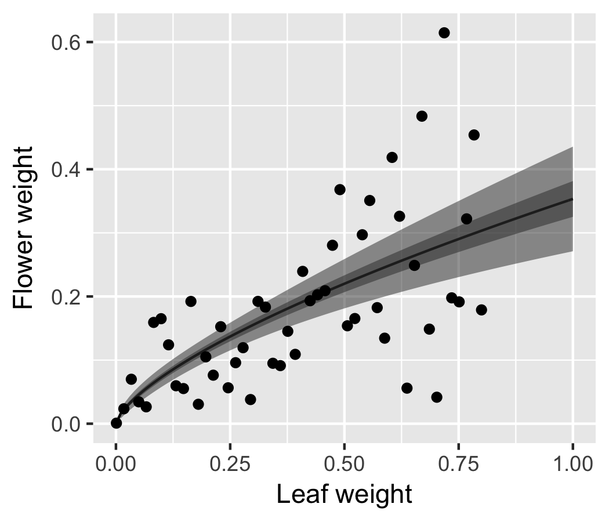

# 参考
[データ解析のための統計モデリング入門――一般化線形モデル・階層ベイズモデル・MCMC (確率と情報の科学)](https://www.amazon.co.jp/%E3%83%87%E3%83%BC%E3%82%BF%E8%A7%A3%E6%9E%90%E3%81%AE%E3%81%9F%E3%82%81%E3%81%AE%E7%B5%B1%E8%A8%88%E3%83%A2%E3%83%87%E3%83%AA%E3%83%B3%E3%82%B0%E5%85%A5%E9%96%80__%E4%B8%80%E8%88%AC%E5%8C%96%E7%B7%9A%E5%BD%A2%E3%83%A2%E3%83%87%E3%83%AB%E3%83%BB%E9%9A%8E%E5%B1%A4%E3%83%99%E3%82%A4%E3%82%BA%E3%83%A2%E3%83%87%E3%83%AB%E3%83%BBMCMC-%E7%A2%BA%E7%8E%87%E3%81%A8%E6%83%85%E5%A0%B1%E3%81%AE%E7%A7%91%E5%AD%A6-%E4%B9%85%E4%BF%9D-%E6%8B%93%E5%BC%A5/dp/400006973X/ref=sr_1_2?ie=UTF8&qid=1492985709&sr=8-2&keywords=%E4%B9%85%E4%BF%9D%E7%B5%B1%E8%A8%88)  
  

```{r}
library(tidyverse)
```
* ロジスティック回帰: あるできごとが発生する確率
<br>
<br>

# 6.1 さまざまな種類のデータで応用できるGLM
## GLMの特徴
* 確率分布、リンク関数、線形予測子の組み合わせ方で、様々なタイプのデータを表現できる

データの形|確率分布|乱数発生|glm()のfamily|よく使うリンク関数
:-:|:-:|:-:|:-:|:-:
離散|二項分布|rbinom()|binomal|logit
離散|ポワソン分布|rpois()|poisson|log
離散|負の二項分布|rnbinom()|glm.nb()|log
連続|ガンマ分布|rgammma()|gamma|logかな？
連続|正規分布|rnorm()|gaussian|identity
<br>
<br>

# 6.2 例題: 上限のあるカウントデータ
```{r}
# 觀察種子数: Ni = 8 ( わかりやすくするために固定 )
# 生存種子数: yi
# 肥料fi: 肥料なし(C)、肥料あり(T)
# 体サイズ:  xi
# 生存確率: qi
d4a <-
  tbl_df(read.csv("http://hosho.ees.hokudai.ac.jp/~kubo/stat/iwanamibook/fig/binomial/data4a.csv"))


ggplot(d4a, aes(x=x, y=y, color=f))+
  geom_point()+
  xlab("Size")+ylab("Number of survival seeds")
ggsave("Greenbook/Figure/6-2.png",plot=last_plot(), width=3.5, height=3)
```


* 体サイズが大きくなると生存種子数が多い
* 肥料をやるとが生存種子数が多くなる
<br>
<br>

# 6.3 二項分布で表現する「ありなし」カウントデータ
* 二項分布は上限の有るカウントデータを表現するために使用する
  * 統計モデリングを工夫すれば、ポアソン分布でも表現可能
* y=0,1 のものをベルヌーイ分布という
  * Rでは二項分布に含まれている

$$
p(y|N,q) = \left(\begin{array}{c}N\\ y\end{array}\right)q^y(1-q)^{N-y}
$$

```{r}
`Q = 0.1` <- rbinom(100, size=8, prob=0.1)
`Q = 0.3` <- rbinom(100, size=8, prob=0.3)
`Q = 0.8` <- rbinom(100, size=8, prob=0.8)
Binomal <- tbl_df(cbind.data.frame(`Q = 0.1`,`Q = 0.3`,`Q = 0.8`))
Binomal_Prob <- 
  Binomal %>% 
  gather(q, x) %>%
  group_by(q, x) %>%
  summarise(`p(yi|8,q)`=n()/100)

ggplot(Binomal_Prob, aes(x=x,y=`p(yi|8,q)`))+
  geom_line(aes(color=q))+
  geom_point()
ggsave("Greenbook/Figure/6-3.png",plot=last_plot(), width=4.5, height=4)
```


* p(y|N,q): N個中のy個で事象事象が生起する確率
  * Nこの各要素で事象が生起する確率
* (N y): 場合の数
  * N個の觀察種子野中からy個の生存種子を選び出す場合の数
<br>
<br>

# 6.4 ロジスティック回帰とロジットリンク関数
## ロジスティック回帰
* 確率分布: 二項分布
* リンク関数: ロジットリンク関数

# 6.4.1 ロジットリンク関数
* 二項分布では事象が生起する確率をパラメーターで指定する必要がある
  * 種子の生存確率qiが相当
  * 0 < qi < 1
* ロジットリンク関数はqiの制約と線形予測子をうまく関連付けるリンク関数

## ロジスティック関数
$$
qi= logistic(z_i) = \frac{1}{1+exp(-z_i)}
z_i =  \beta_1 + \beta_2 x_i
$$

```{r}
logistic <- function(z)(1/(1+exp(-z)))
z <- seq(-6,6,0.1)
Logistic <- tbl_df(cbind.data.frame(z,logistic(z)))

ggplot(Logistic,aes(x=z,y=`logistic(z)`))+
  geom_line()+xlab(" Linear predictor ( zi )") + ylab("Probability ( q )")
ggsave("Greenbook/Figure/6-4.png",plot=last_plot(), width=3.5, height=3)
```


* ロジスティック関数は線形予測子がいくつであろうと、常に0から1の値を取る


```{r}
logistic <- function(z)(1/(1+exp(-z)))
x <- seq(-3,3,0.1)

# ziをxによる線形予測子で表現する
# zi = β1 + β2xi

# 1. β2=2のとき
`Beta1=0, Beta2=2` <- logistic(0+2*x)
`Beta1=2, Beta2=2` <- logistic(2+2*x)
`Beta1=-3, Beta2=2` <- logistic(-3+2*x)

`Beta2=2` <-
  tbl_df(cbind.data.frame(x,
                          `Beta1=0, Beta2=2`,
                          `Beta1=2, Beta2=2`,
                          `Beta1=-3, Beta2=2`)) %>%
  gather(Beta, y, -x)

 ggplot(`Beta2=2`, aes(x=x,y=y))+
   geom_line(aes(color=Beta))
 ggsave("Greenbook/Figure/6-5A.png",plot=last_plot(), width=5, height=3)

# 2. β1=0のとき
`Beta1=0, Beta2=-1` <- logistic(0+(-1)*x)
`Beta1=0, Beta2=2` <- logistic(0+(2)*x)
`Beta1=0, Beta2=4` <- logistic(0+(4)*x)

`Beta1=0` <-
  tbl_df(cbind.data.frame(x,
                          `Beta1=0, Beta2=-1`,
                          `Beta1=0, Beta2=2`,
                          `Beta1=0, Beta2=4`)) %>%
  gather(Beta, y, -x)

 ggplot(`Beta1=0`, aes(x=x,y=y))+
   geom_line(aes(color=Beta))
ggsave("Greenbook/Figure/6-5B.png",plot=last_plot(), width=5, height=3)
```

### β2 = 2のとき


### β1 = 0のとき


ロジスティック関数をz_iについて解くと

$$
log \frac{q_i}{1-q_i} =z_i
$$

となり、左辺のことをロジット関数と呼ぶ
* ロジット関数はロジスティック関数の逆関数
<br>
<br>


## 6.4.2 パラメーター推定

### 尤度関数 ( 尤度の総積 )
$$
L({\beta_i})=\prod_{i}\left(\begin{array}{c}N_i\\ y_i\end{array}\right)q_i^{y_i}(1-q_i)^{N_i-y_i}
$$

### 対数尤度関数
$$
logL({\beta_i})=\sum_{i}[{log\left(\begin{array}{c}N_i\\ y_i\end{array}\right) +{y_i} log(q_i) + {(N_i-y_i)} log (1-q_i)}]
$$
* qiはβ1, β2, β3に依存する関数

## 最尤推定
* logLを最大にする推定値{β1,β2,β3の組み合わせを探す

```{r }
glm(cbind(y, N-y)~x+f, # cbind(生存数,死んだ数)
    data=d4a,
    family=binomial)
```

```
Call:  glm(formula = cbind(y, N - y) ~ x + f, family = binomial, data = d4a)

Coefficients:
(Intercept)            x           fT  
    -19.536        1.952        2.022  

Degrees of Freedom: 99 Total (i.e. Null);  97 Residual
Null Deviance:	    499.2 
Residual Deviance: 123 	AIC: 272.2
```

## ロジスティック回帰のモデルの推定
```{r}
# d4aから生存確率qを計算する
d4a2 <- d4a %>% mutate(q=y/N)

# 予測モデルを作ってデータを生成
Size <- rep(seq(min(d4a$x),max(d4a$x),0.1),2)
Fertilization <- c(rep("C",length(Size)/2),rep("T",length(Size)/2))

q_Pred <- predict(
  glm(cbind(y, N-y)~x+f, # cbind(生存数,死んだ数)
    data=d4a,
    family=binomial), # GLMによるモデル
                   newdata= data.frame(x=Size,f=Fertilization), # 予測したいデータ
                   type="response")
d4a_Pred <- tbl_df(cbind.data.frame(Size, Fertilization, q_Pred))

# ggplot
ggplot(d4a2, aes(x=x,y=q))+
  geom_line(data=d4a_Pred, aes(x=Size,y=q_Pred,color=Fertilization))+
  geom_point(aes(color=f))+
  xlab("Size")+ylab("Survival rate")
ggsave("Greenbook/Figure/6-7.png",plot=last_plot(), width=4.5, height=3)
```


<br>
<br>

## 6.4.3 ロジットリンク関数の意味・解釈
$$
\begin{eqnarray}
\frac{q_i}{1-q_i} &=& exp(\mbox{線形予測子}) \\
&=& exp(\beta_1+\beta_2x_i+\beta_3f_i) \\
&=& exp(\beta_1)*exp(\beta_2x_i)*exp(\beta_3f_i)
\end{eqnarray}
\\
\frac{q_i}{1-q_i} = \frac{\mbox{生存する確率}}{\mbox{生存しない確率}} = \mbox{オッズ}\\
log\frac{q_i}{1-q_i} = \beta_1+\beta_2x_i+\beta_3f_i = \mbox{線形予測子}
$$


## 6.4.4 ロジスティック回帰のモデル選択
```{r }
library("MASS")

# stepAIC()
# ネストしてるモデルのAICを自動的に比較しながらAIC最小モデルを選択できる
stepAIC(
  glm(cbind(y, N-y)~x+f, # cbind(生存数,死んだ数)
    data=d4a,
    family=binomial))
```

```
Start:  AIC=272.21
cbind(y, N - y) ~ x + f

       Df Deviance    AIC
<none>      123.03 272.21
- f     1   217.17 364.35
- x     1   490.58 637.76

Call:  glm(formula = cbind(y, N - y) ~ x + f, family = binomial, data = d4a)

Coefficients:
(Intercept)            x           fT  
    -19.536        1.952        2.022  

Degrees of Freedom: 99 Total (i.e. Null);  97 Residual
Null Deviance:	    499.2 
Residual Deviance: 123 	AIC: 272.2
```
* x+fを組み込んだモデルが最もAICがが低くなるのでモデルとして適当である
<br>
<br>

## 6.5 交互作用項の入って線形予測子
$$
logit(q_i)=\beta_i+\beta_2x_i+\beta_3f_i+\beta_4X_if_i
$$
* 交互作用
  * 植物のサイズ xi と施肥効果 fi の相乗効果

```{r }
glm(cbind(y, N-y)~x+f, # x+fでなくx*f
    data=d4a,
    family=binomial)

glm(cbind(y, N-y)~x*f, # x+fでなくx*f
    data=d4a,
    family=binomial)
```

```
> glm(cbind(y, N-y)~x+f, # x+fでなくx*f
+     data=d4a,
+     family=binomial)

Call:  glm(formula = cbind(y, N - y) ~ x + f, family = binomial, data = d4a)

Coefficients:
(Intercept)            x           fT  
    -19.536        1.952        2.022  

Degrees of Freedom: 99 Total (i.e. Null);  97 Residual
Null Deviance:	    499.2 
Residual Deviance: 123 	AIC: 272.2
> 
> glm(cbind(y, N-y)~x*f, # x+fでなくx*f
+     data=d4a,
+     family=binomial)

Call:  glm(formula = cbind(y, N - y) ~ x * f, family = binomial, data = d4a)

Coefficients:
(Intercept)            x           fT         x:fT  
  -18.52332      1.85251     -0.06376      0.21634  

Degrees of Freedom: 99 Total (i.e. Null);  96 Residual
Null Deviance:	    499.2 
Residual Deviance: 122.4 	AIC: 273.6
```

* x*fでAICが低下する
* 相互作用を考慮してもモデルはよくならず、関係なさそうという形になる
* むやみに交互作用項をを入れないことが重要
  * パラメーターの数が増大して推定が困難となるため
<br>
<br>

# 6.7 正規分布とその尤度
## 正規分布
* またの名をガウス分布
* 連続値のデータを統計モデルで扱うためのもの
* 平均値のパラメーター μ と 標準偏差を表す σ から成る
  * ポワソン分布は平均と分散
* 正規分布の確率密度関数

$$
p(y|\mu,\sigma)=\frac{1}{\sqrt{2 \pi \sigma}}exp[-\frac{(y-\mu)^2}{2\sigma^2}]
$$

## 図6.11 正規分布の確率密度関数

```{r }
x <- seq(-5,5,0.1)
y <- dnorm(x, mean=0, sd=1)
df <- tbl_df(cbind.data.frame(y,x))
ggplot(df, aes(x=x,y=y))+
  geom_line()
ggsave("Greenbook/Figure/6-11.png",plot=last_plot(), width=3.5, height=3)
```


* 連続血なので　" 確率密度 "　になっている
* 連続地の確率分布では確率密度の積分量が確率と定義される

```{r }
# 1.2 =< x =< 1.8となる確率を求める
pnorm(1.8,0,1) - pnorm(1.2,0,1)
```

```
> pnorm(1.8,0,1) - pnorm(1.2,0,1)
[1] 0.07913935
```

## 確率 = 確率密度関数　× ⊿y
* これを長方形の面積で近似させることができ、最尤推定に用いる
  * 区間の中間値における確率密度を高さ
  * 区間の幅を横
  * として長方形の面積を計算する
  
```{r }
  dnorm(1.5,0,1) * ( 1.8 - 1.2 )
```

```  
> dnorm(1.5,0,1) * ( 1.8 - 1.2 )
[1] 0.07771056
```

## N人からなる人間の集団の身長データをY={yi}と定義する
$$
\begin{eqnarray}
L(\mu,\sigma) &=& \prod_ip(y_i|\mu,\sigma) \Delta y \\
&=& \prod_i \frac{1}{\sqrt{2 \pi \sigma^2}} exp[-\frac{(y-\mu)^2}{2\sigma^2}] \Delta y \mbox{   ( 正規分布の確率密度関数を代入 ) }\\
LogL(\mu,\sigma) &=& -0.5Nlog(2\ \pi \sigma^2) - \frac{1}{2 \sigma^2} \sum_i(y_i-\mu)^2 + Nlog(\Delta y) \mbox{ ( 対数をとる )} \\
&=& -0.5Nlog(2\ \pi \sigma^2) - \frac{1}{2 \sigma^2} \sum_i(y_i-\mu)^2 \mbox{ ( ⊿yは定数であり無視する )}
\end{eqnarray}
$$

* 対数尤度は正になったり、AICが負になったりする
* 最終的にはσがμと無関係な定数と仮定すると
  * 残る変数はΣ(yi-μ)^2だけとなる
  * これは二乗誤差の和であり、これを最小とすると最大対数尤度が求められる
  * 最小二乗法の求め方と一致する
<br>
<br>

# 6.8 ガンマ分布のGLM
## ガンマ分布
$$
p(y|s,r)=\frac{r^s}{\Gamma(s)}y^{s-1}exp(-ty)
$$
* 確率変数の取りうる取りうる範囲が0以上の連続確率分布
* s: shapeパラメーター
* r: rateパラメーター
* Γ(s): ガンマ関数
* 平均: s/r
* 分散: s/r^2
* s=1のときに指数分布という

## 図6.12
```{r}
Leaf <- seq(0,4,0.01)
`r=s=1` <- dgamma(Leaf,1,1)
`r=s=5` <- dgamma(Leaf,5,5)
`r=s=0.1` <- dgamma(Leaf,0.1,0.1)

df <-
  tbl_df(cbind.data.frame(Leaf,`r=s=1`,`r=s=0.1`,`r=s=5`)) %>%
  gather(Parameter, Value, -Leaf)

ggplot(df, aes(x=Leaf, y=Value, color=Parameter))+
         geom_line()+ylim(0,1)
ggsave("Greenbook/Figure/6-12.png",plot=last_plot(), width=4, height=3)
```


## 図6.13
* y = 花の重量: 平均μのガンマ分布に従う
* x = 葉の重量
* 平均花重量 μ が葉重量xiの単調増加関数で以下の様に仮定する

$$
\begin{eqnarray}
\mu_i&=&Ax^b_i \\
&=& exp(a) x^b_i \mbox{ ( A=exp(a) とおく )}\\
&=& exp(a+b \log x_i) \\
\log \mu_i &=& a+b \log x_i \mbox{ ( 両辺の対数をとる ) }
\end{eqnarray}
$$

* 上記の式より、線形予測子 a+blogxiと対数リンク関数を用いて平均μiが求められることがわかる
* 線形予測子は説明変数xiではなくlogxiであることに注意
* 推定すべきパラメーターは切片と傾きのみ
  * 平均・分散をshape/rateパラメーターとどう対応するか気にしなくてよい
  

```{r}
load(url("http://hosho.ees.hokudai.ac.jp/~kubo/stat/iwanamibook/fig/gamma/d.RData"))
d

Leaf <- seq(0,1,0.01)

Fit <-
  glm(y~log(x),
    family=Gamma(link="log"),
    data=d,
    se.fit=TRUE)

Flower_pred <- 
  predict(Fit,
        newdata= data.frame(x=Leaf),
        type="response",
        se.fit=TRUE) # これをTRUEにするとSEを計算してくれる

df_pred <-
  tbl_df((cbind.data.frame(Leaf, Flower_pred=Flower_pred$fit, SE=Flower_pred$se.fit)))

ggplot(df_pred)+
  geom_line(aes(x=Leaf,y=Flower_pred))+
  geom_ribbon(aes(x=Leaf,
                  ymin = Flower_pred-1.96*SE, ymax = Flower_pred+1.96*SE),
              alpha=0.5)+
  geom_ribbon(aes(x=Leaf,
                  ymin = Flower_pred-0.67	*SE, ymax = Flower_pred+0.67*SE),
              alpha=0.5)+
  geom_point(data=d, aes(x=x,y=y))+
  xlab("Leaf weight")+ylab("Flower weight")
ggsave("Greenbook/Figure/6-13.png",plot=last_plot(), width=3.5, height=3)
```


