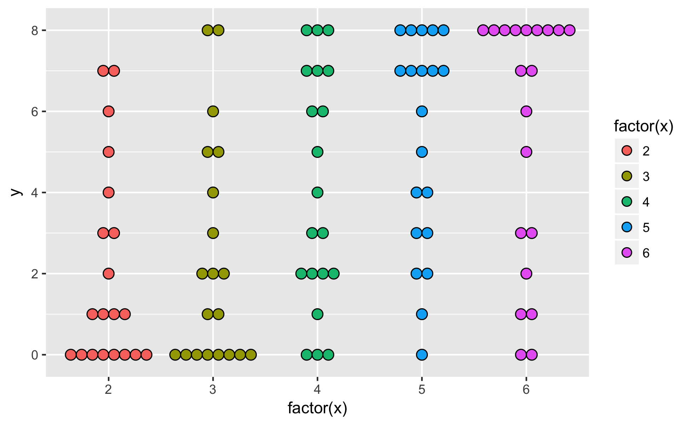
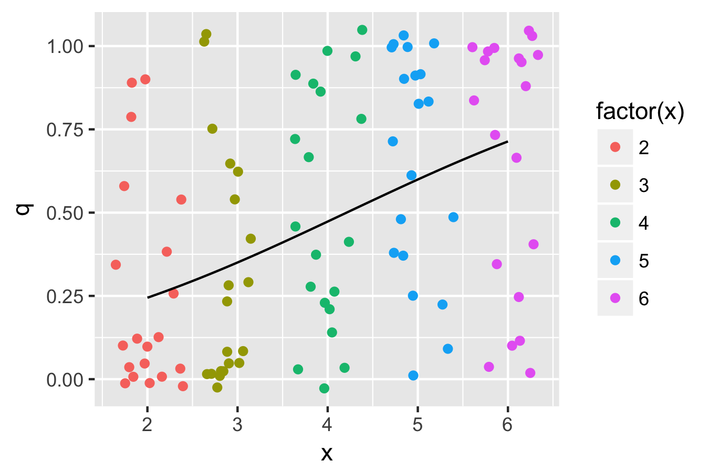
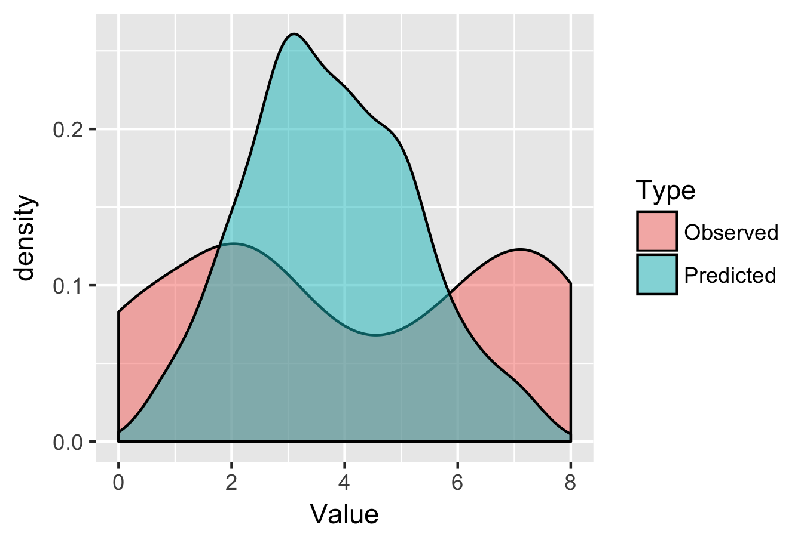
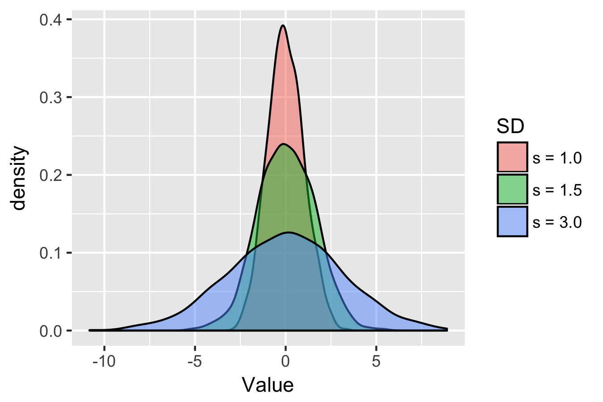
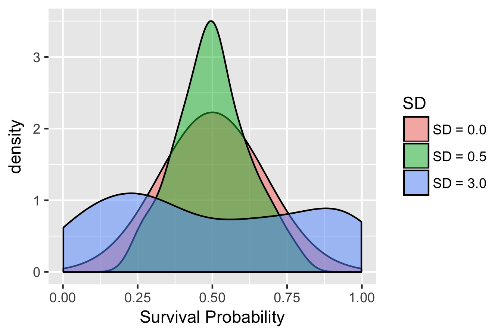
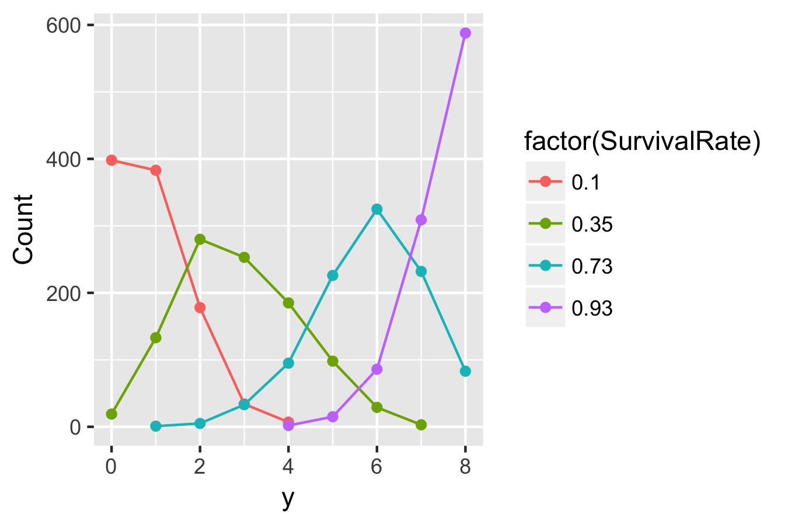
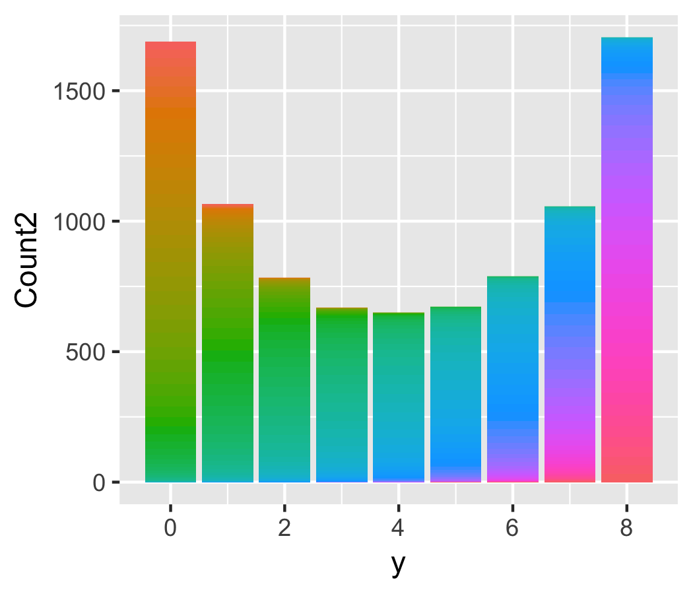

# 参考
[データ解析のための統計モデリング入門――一般化線形モデル・階層ベイズモデル・MCMC (確率と情報の科学)](https://www.amazon.co.jp/%E3%83%87%E3%83%BC%E3%82%BF%E8%A7%A3%E6%9E%90%E3%81%AE%E3%81%9F%E3%82%81%E3%81%AE%E7%B5%B1%E8%A8%88%E3%83%A2%E3%83%87%E3%83%AA%E3%83%B3%E3%82%B0%E5%85%A5%E9%96%80__%E4%B8%80%E8%88%AC%E5%8C%96%E7%B7%9A%E5%BD%A2%E3%83%A2%E3%83%87%E3%83%AB%E3%83%BB%E9%9A%8E%E5%B1%A4%E3%83%99%E3%82%A4%E3%82%BA%E3%83%A2%E3%83%87%E3%83%AB%E3%83%BBMCMC-%E7%A2%BA%E7%8E%87%E3%81%A8%E6%83%85%E5%A0%B1%E3%81%AE%E7%A7%91%E5%AD%A6-%E4%B9%85%E4%BF%9D-%E6%8B%93%E5%BC%A5/dp/400006973X/ref=sr_1_2?ie=UTF8&qid=1492985709&sr=8-2&keywords=%E4%B9%85%E4%BF%9D%E7%B5%B1%E8%A8%88)  
  

```{r}
library(tidyverse)

d7 <-
  tbl_df(read.csv("http://hosho.ees.hokudai.ac.jp/~kubo/stat/iwanamibook/fig/glmm/data.csv"))

ggplot(d7, aes(x=factor(x),y=y, fill=factor(x)))+
  geom_dotplot(size=0.5, binaxis = "y", stackdir = "center",position = "dodge")
ggsave("Greenbook/Figure/7-2.png",plot=last_plot(), width=6.5, height=4)
```



```{r}
d7$q <- d7$y / d7$N

glm(cbind(y,N-y)~x,
    data=d7,
    family=binomial)

x_Pred <- rep(seq(min(d7$x),max(d7$x),0.1))

q_Pred <- predict(
  glm(cbind(y, N-y)~x, # cbind(生存数,死んだ数)
    data=d7,
    family=binomial), # GLMによるモデル
                   newdata= data.frame(x=x_Pred), # 予測したいデータ
                   type="response")
d7_Pred <- tbl_df(cbind.data.frame(x_Pred, q_Pred))

ggplot(d7, aes(x=x,y=q))+
  geom_jitter(aes(color=factor(x))) +
  geom_line(data=d7_Pred, aes(x=x_Pred,y=q_Pred))+
  xlab("Size")+ylab("Survival rate")
ggsave("Greenbook/Figure/7-3A.png",plot=last_plot(), width=4.5, height=3)

dev.off()
```



* 真の傾きからすると傾きが小さくなっている

```{r}
set.seed(2)
# xi=4の時の生存率
q_Pred_4 <- as.numeric(d7_Pred[x_Pred==4,2])

# この時の二項分布
Predicted <- rbinom(100, size=8, prob=q_Pred_4)

# xi = 4のときのyの頻度
Observed <- (d7 %>% filter(x==4))$y

df <- tbl_df(cbind.data.frame(Predicted,Observed)) %>%
  gather(Type, Value)

# 確率密度関数で描
ggplot(df, aes(x=Value, fill=Type))+
  geom_density(alpha=0.5)
ggsave("Greenbook/Figure/7-3B.png",plot=last_plot(), width=4.5, height=3) 
```



* 觀察された生存種子数は二項分布には従っていない

# 7.2 過分散と個体差
* 過分散
  * 二項分布で期待されるよりも大きなばらつき

## 7.2.1 過分散
```{r}
# x = 4の時のyの分散
mean((d7[d7$x==4,])$y) # 平均
var((d7[d7$x==4,])$y) # 分散

# 二項分布から計算される生存確率の分散
# 二項分布の分散 = n * q * ( 1-q )
q = mean((d7[d7$x==4,])$y)/8 # 生存確率の平均
n=8
n * q * ( 1-q )
```

```
> # x = 4の時のyの分散
> mean((d7[d7$x==4,])$y) # 平均
[1] 4.05
> var((d7[d7$x==4,])$y) # 分散
[1] 8.365789
```

```
> # 二項分布から計算される生存確率の分散
> # 二項分布の分散 = n * q * ( 1-q )
> q = mean((d7[d7$x==4,])$y)/8 # 生存確率の平均
> n=8
> n * q * ( 1-q )
[1] 1.999688
```

* 4倍近く過分散である
  * 二項分布を使って説明するのは厳しい

## 7.2.2 観測されていない個体差がもたらす過分散
## 7.2.3 観測されていない個体差とは何か？
* ずれの原因は観測されていない個体差
* この個体たちはみんな均一、という過度に単純化した仮定が間違い

# 7.3 一般化線形混合モデル
* 一般化線形混合モデル
  * 個体差や場所差の効果をGLMに組み込んだ統計モデル

## 7.3.1 個体差を表すパラメーターの追加
$$
logit(q_i) = \beta_1+\beta_2x_i+\gamma_i
$$

* 個体差を表すパラメーター γi
  * -∞ -> ∞ までの範囲をとる連続値
* GLM観測されていない個体差などないと仮定
  * γi = 0
  
## 7.3.2 個体差のばらつきを表す確率分布
## 7.3.3 線形予測子の構成要素: 固定効果とランダム効果
### 正規分布の確率密度関数
$$
p(|\mu,\sigma) = \frac{1}{\sqrt{pi \sigma^2}}exp[-\frac{(y-\mu)^2}{2 \sigma^2}] \\
$$
なので、μ = 0, σ = s ( SD ), y = γiを代入すると
$$
p(|\gamma_i,s) = \frac{1}{\sqrt{pi s^2}}exp[-\frac{(\gamma_i)^2}{2 s^2}]
$$
が得られる。

* GLMMの特徴
  * 個体差を表すパラメーター{γ1, γ2, ... , γ100}が何か確率分布に従っていると仮定する
    * ランダム効果 ( Random effects )
  * 切片や傾きは確率分布に従うとは考えない
    * 固定効果 ( Fixed effects )
* 今回の例題では
  * 個体差γiは平均0で標準偏差sの正規分布に従うと仮定
  * 正規分布を採用する根拠は何もない
  * そもそも観測できない値なので、検証できない
  * ただ単に統計モデリングにおいて便利であるから
* γiがirregularな値をとる傾向が強いとき
  * すそのの重いt分布などを用いる
  * γiが正規分布より複雑かもと思ったら階層ベイズモデルを使おう!
* 各個体のγiは個体間ｄで相互に独立した確率変数であるとする

## 図7.6: 個体差をあらわす平均0の正規分布の確率密度関数

```{r}
`s = 1.0` <- rnorm(1000, mean=0, sd=1.0)
`s = 1.5` <- rnorm(1000, mean=0, sd=1.5)
`s = 3.0` <- rnorm(1000, mean=0, sd=3.0)

df <-
  tbl_df(cbind.data.frame(`s = 1.0`,`s = 1.5`,`s = 3.0`)) %>%
  gather(SD,Value)

ggplot(df, aes(x=Value, fill=SD))+
  geom_density(alpha=0.5)
ggsave("Greenbook/Figure/7-6.png",plot=last_plot(), width=4.5, height=3) 
```



$$
p(\gamma_i|s)=\frac{1}{\sqrt{2 \pi s^2}}exp(-\frac{\gamma_i^2}{2 s^2})
$$
* p(γi|s): sの時のγi、γiの出現しやすさ
* s: 集団内のγiのばらつき
  * 大きいほど過分散がひどくなりそう
  
## 図7.7 個体差γiとばらつきの大きさsと過分散の関係
```{r}
d7 <-
  tbl_df(read.csv("http://hosho.ees.hokudai.ac.jp/~kubo/stat/iwanamibook/fig/glmm/data.csv"))


rbinom(100,prob=q)


# 誤差γiを平均0の正規分布に従って発生させる
set.seed(100)
d7$s0.0 <- rnorm(1000, mean=0, sd=0)
d7$s0.5 <- rnorm(1000, mean=0, sd=0.5)
d7$s3.0 <- rnorm(1000, mean=0, sd=3)

# それぞれのSDをとる時の生存確率
`SD = 0.0` <- 1/(1+exp(-d7$s0.0))
`SD = 0.5` <- 1/(1+exp(-d7$s0.5))
`SD = 3.0` <- 1/(1+exp(-d7$s3.0))

df <-
  tbl_df(cbind.data.frame(`SD = 0.0`,`SD = 0.5`,`SD = 3.0`)) %>%
  gather(SD,`Survival Probability`)

ggplot(df, aes(x=`Survival Probability`, fill=SD))+
  geom_density(alpha=0.5)
ggsave("Greenbook/Figure/7-7.png",plot=last_plot(), width=4.5, height=3) 
```


* SD = 0 は個体差がなく全部均一なものと仮定したモデル
* 個体差のばらつきが小さい　SD = 0.5 はSD = 0のグラフと大きく変わらない
* 個体差のばらつきが大きい SD = 3.0 はSD = 0のグラフと乖離する


# 7.4 一般化線形モデルの最尤推定
* GLMMに含まれている個体差は最尤推定出来ない
  * 100個分のyの値を求めるのに100個のrの値を用いる必要がある
  * フルモデルでないと説明できない
* 最尤推定できない個体差rを含むモデルで、切片と傾きを最尤推定するには？
  * 個体ごとの尤度の式の中でrを積分する
  
$$
L_i=\int_{-\infty}^{\infty} p(y_i|\beta_1,\beta_2,\gamma_i)p(\gamma_i|s)d\gamma_i
$$

* ある誤差の値rを仮定しこの時に生存確率qの二項分布を描く
* この分布が起こりうる確率をrの母集団である正規分布から求める
* 生存確率qの二項分布に確率をかけて、二項分布の期待値を求める
* この計算をriを-∞から∞まで行い、積分する#
# 図7.8 分布を混ぜるという考え方

```{r }
# r = 個体差
# q = 生存確率
# 個体差は平均0、標準偏差3の正規分布に従う
とする
Difference <- c(-2.2, -0.6, 1.0, 2.6)
q <- round(1/(1+exp(-Difference)),2) # 見栄えをよくするため
df <- NULL
for(i in 1:length(q)){
  y = rbinom(1000, size=8, prob=q[i])
  df_i <- cbind.data.frame(q[i],y)
  df <- rbind.data.frame(df_i,df)
}

colnames(df)[1] <- "SurvivalRate"
df <-
  df %>%
  group_by(SurvivalRate,y) %>%
  summarize(Count=n()) 
  
round(df$SurvivalRate,2)
ggplot(df, aes(x=y,y=Count,color=factor(SurvivalRate)))+
         geom_line()+geom_point()
ggsave("Greenbook/Figure/7-8-1.png",plot=last_plot(), width=4.5, height=3)
```



```{r}
Difference　<- seq(-5,5,0.1)
q <- 1/(1+exp(-Difference)) 
`p(ri|s)` <- dnorm(Difference,mean=0,sd=3) 

df <- NULL
for(i in 1:length(q)){
  y = rbinom(1000, size=8, prob=q[i])
  df_i <- cbind.data.frame(q[i],`p(ri|s)`[i],y)
  df <- rbind.data.frame(df_i,df)
}

colnames(df)[1] <- "SurvivalRate"
colnames(df)[2] <- "p(ri|s)"

df2 <-
  tbl_df(df) %>%
  group_by(SurvivalRate,`p(ri|s)`,y) %>%
  summarize(Count=n()) %>%
  mutate(Count2=Count*`p(ri|s)`)
  
ggplot(df2,
       aes(x=y,y=Count2,fill=factor(SurvivalRate)))+
         geom_bar(stat="identity")+
  guides(fill=FALSE)
ggsave("Greenbook/Figure/7-8-3.png",plot=last_plot(), width=3.5, height=3)
```


  
# 7.4.1 Rを使ってGLMMのパラメーターを推定する
* RにおいてはglmmML()を用いる
  * GLMMをML ( 最尤推定: maximum likelihood estimation ) するという意味
* riが個体ごとに異なる独立なパラメーターであることを示す必要
  * clusterオプション
  * idを使うのが楽
  * glmmMLでは1種類しか指定できない
* データのばらつきの確率分布として使えるのは二項分布とポアソン分布のみ

```{r}
d7 <-
  tbl_df(read.csv("http://hosho.ees.hokudai.ac.jp/~kubo/stat/iwanamibook/fig/glmm/data.csv"))

install.packages("glmmML")
library(glmmML)
glmmML(cbind(y,N-y)~x,
       data=d7,
       family=binomial,
       cluster=id)
```

```
Call:  glmmML(formula = cbind(y, N - y) ~ x, family = binomial, data = d7,      cluster = id) 


              coef se(coef)      z Pr(>|z|)
(Intercept) -4.190   0.8777 -4.774 1.81e-06
x            1.005   0.2075  4.843 1.28e-06

Scale parameter in mixing distribution:  2.408 gaussian 
Std. Error:                              0.2202 

        LR p-value for H_0: sigma = 0:  2.136e-55 

Residual deviance: 269.4 on 97 degrees of freedom 	AIC: 275.4 
```

* coef: 切片と傾きの最尤推定結果
* Scale parameter: 個体差riのばらつきの最尤推定値
  * Std. Error: sの推定値のばらつき ( 標準誤差 )
    * 2.408と久保先生が発生させた母集団 ( 3.0 ) と比べると過小推定してはいる
* degrees of freedon ( 自由度 )
  * β1、β2、sの3パラメーターを100個のデータを評価するのに使っている
  * 使える残りのパラメーターは97個ですよということ
* AICは275.4であり、glmの649と比べると飛躍的に改善している
